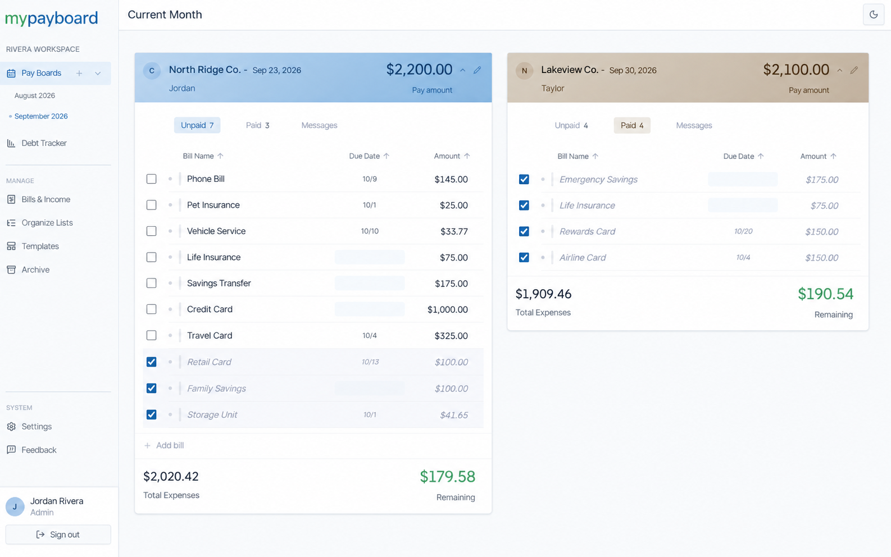
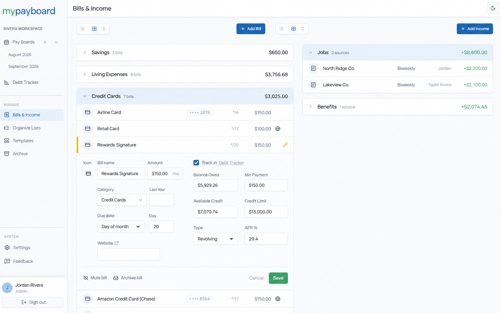
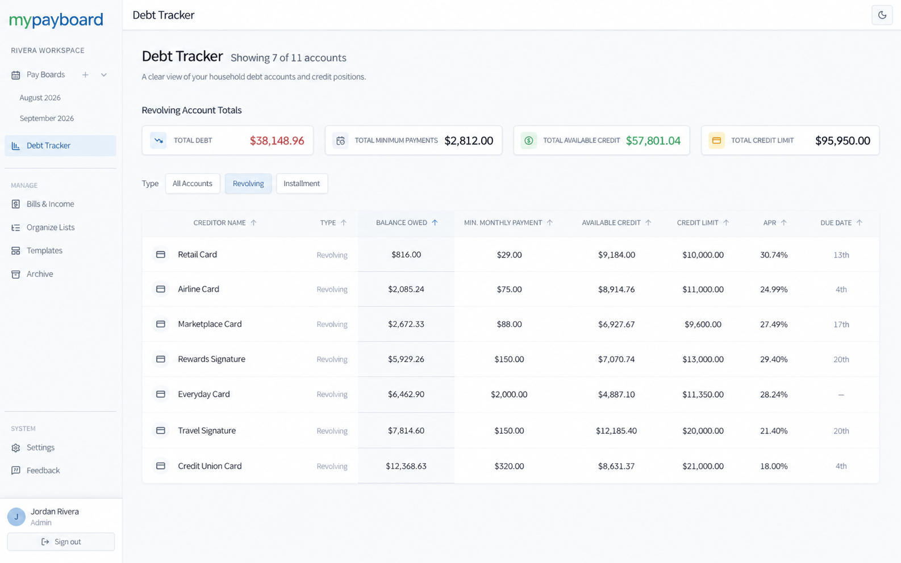
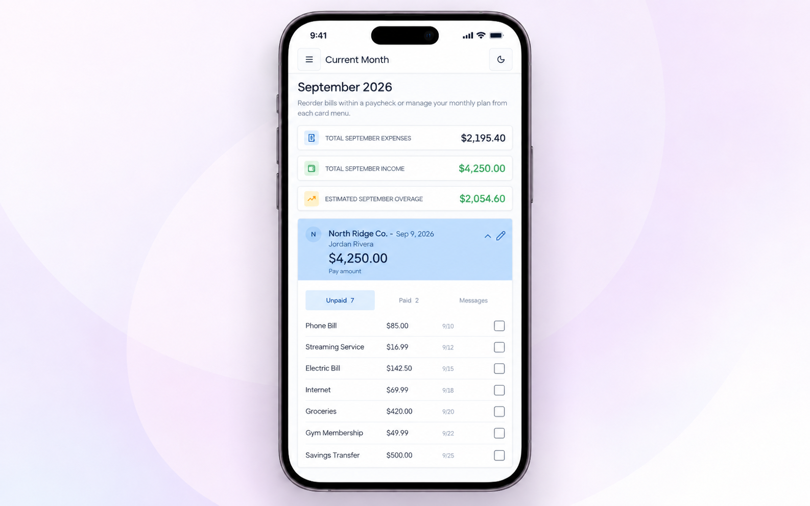

<div align="center">


# MyPayBoard

**The paycheck-first way to plan your household's money.**


[Sign Up](https://mypayboard.com) · [Feature Overview](https://mypayboard.com/features) · [For Developers](#for-developers)

</div>

<br>

<div align="center">
  
</div>

<br>

## What is MyPayBoard?

Most budgeting apps organize your money around the calendar. MyPayBoard organizes it around your paychecks — because that's how households actually plan.

Every pay date gets its own card, holding exactly the bills that need to be covered before the next one lands. No monthly spreadsheets, no bank-linked spending analytics, no investment dashboards — just a clear answer to the question every household asks: **what needs to be paid when we get paid?**

MyPayBoard is built for two people to plan together — shared boards, per-card notes, and unread indicators so nothing falls through the cracks between partners.

## See it in action

<table>
<tr>
<td width="50%"><br><sub align="center">Bills & Income — your source of truth</sub></td>
<td width="50%"><br><sub align="center">Debt Tracker — balances, APR, minimums</sub></td>
</tr>
</table>

<div align="center">
  
  <br><sub>Fully usable on mobile — plan from anywhere</sub>
</div>

## Features

- **Pay Date Cards** — one card per paycheck, with the bills planned against it
- **Bills & Income** — the master list every board pulls from, with expand-in-place editing
- **Debt Tracker** — a filtered view of debt-tracked creditors, no separate app needed
- **Templates** — frozen snapshots of your master list, so new boards take seconds to spin up
- **Archive** — nothing is deleted by default; past boards and inactive items are just tucked away
- **Household collaboration** — shared boards, per-card notes, and live sync between partners

→ [Full feature breakdown](https://mypayboard.com/features)

## Try it out

MyPayBoard is live and open to any household who wants to try it. It's still a small, actively growing product — if something feels off, or you've got an idea for what would make it better, we'd genuinely love to hear it.

[Sign up →](https://mypayboard.com)

## Status

Live and growing. Real households are already planning their pay dates in MyPayBoard, and it keeps getting sharper based on how people actually use it.

<br>

---

<h2 id="for-developers">For Developers</h2>

<details>
<summary><strong>Tech stack</strong></summary>

<br>

| Package                    | Version  | Purpose                             |
| -------------------------- | -------- | ----------------------------------- |
| `next`                     | 16.2.6   | Framework (App Router)              |
| `react` / `react-dom`      | 19.2.4   | UI library                          |
| `typescript`               | ^5       | Type safety                         |
| `tailwindcss`              | ^4       | Styling                             |
| `@clerk/nextjs`            | ^7.5.7   | Authentication (Google OAuth)       |
| `@supabase/supabase-js`    | ^2.110.0 | Database client                     |
| `@supabase/ssr`            | ^0.12.0  | Supabase SSR helpers                |
| `@dnd-kit/core`            | ^6.3.1   | Drag-and-drop                       |
| `@dnd-kit/sortable`        | ^10.0.0  | Sortable bill lists                 |
| `lucide-react`             | ^1.14.0  | Icons                               |
| `radix-ui`                 | ^1.4.3   | Accessible UI primitives            |
| `shadcn`                   | ^4.7.0   | Component layer on Radix primitives |
| `date-fns`                 | ^4.4.0   | Date formatting and arithmetic      |
| `react-day-picker`         | ^10.0.1  | Calendar date picker                |
| `class-variance-authority` | ^0.7.1   | Variant-based component styling     |
| `clsx`                     | ^2.1.1   | Conditional classnames              |
| `tailwind-merge`           | ^3.6.0   | Safe Tailwind class merging         |
| `tw-animate-css`           | ^1.4.0   | CSS animation utilities             |

**Storage:** Supabase (PostgreSQL) for household data and per-user preferences. Clerk handles authentication.

</details>

<details>
<summary><strong>Getting started</strong></summary>

<br>

Install dependencies:

```bash
npm install
```

Run the local development server:

```bash
npm run dev
```

Open `http://localhost:3000`. Sign in with Google.

Other scripts:

```bash
npm run build    # production build
npm run start    # serve production build
npm run lint     # ESLint
```

</details>

<details>
<summary><strong>Design system</strong></summary>

<br>

- **Font:** Manrope
- **Themes:** Daylight (light default), Midnight (dark)
- **Motion:** ~150–200ms `ease-out` transitions — visual continuity, not animation
- **Inspiration:** Notion / Linear editorial calm — not banking apps or SaaS dashboards

</details>

<br>

---

<div align="center">
<sub>© 2026 MyPayBoard. All rights reserved.</sub>
</div>
